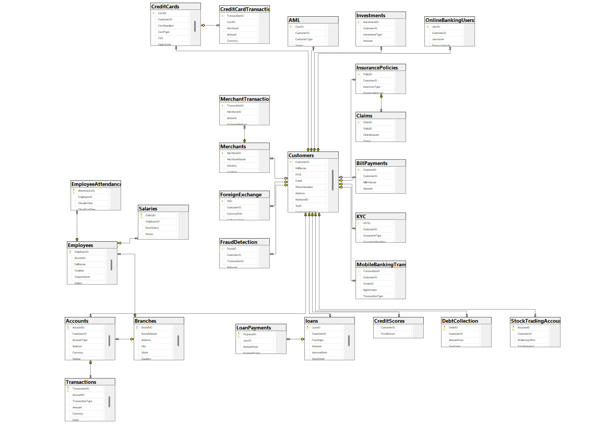

# Banking System — Excel to SQL Server ETL

This project explores building a reliable data ingestion framework for a highly connected banking database. The main challenge lies in managing dependencies across dozens of related tables while ensuring data consistency throughout the loading process. By combining automated validation, configurable table mappings, and bulk data operations, the solution reduces manual effort and provides a reusable foundation for importing large datasets into SQL Server. The project also includes synthetic data generation to support testing, development, and demonstration scenarios.

## 📸 Database Schema

## ✔️ Features
- Reads and processes data from 30 interconnected banking tables stored across multiple Excel sheets
- Validates primary keys, foreign keys, and column data types before loading
- Ensures correct referential loading order (e.g., Customers → Accounts → Transactions)
- Handles complex banking relationships including Loans, Credit Cards, KYC, AML, and Investments
- Config-driven table mapping and dependency management for easy extensibility

## 🔥 Purpose
- Showcase the development of a robust ETL workflow for a relational banking database
- Streamline the process of importing structured spreadsheet data into SQL Server
- Maintain consistency and reliability across related database entities during data ingestion
- Eliminate repetitive manual data-entry and database initialization tasks
- Create a flexible framework that can accommodate schema growth and future extensions
- Support testing and prototyping through automated generation of realistic sample data

## 🛠 Tools Used
- Python → ETL pipeline and random data generation 
- SQL Server → database  
- Excel (CSV/XLSX) → input data  

